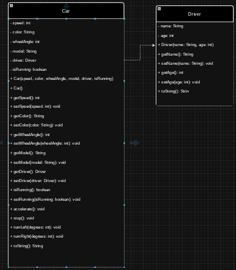

## Project Description
This is a simple Java program that simulates cars and drivers.  
You can create `Car` objects, assign a `Driver` to them, and control the car by accelerating, stopping, or turning.  

**What it does:**  
- Lets you make cars with different colors, models, and drivers.  
- Shows the car’s speed, wheel angle, and running state.  
- Gives a text description of the car and driver.  

**Why it’s cool:**  
- The car has a driver object inside it, showing how objects can work together.  
- Shows examples of overloaded constructors, methods with/without parameters, and getters/setters.

---

## Features
- Car attributes: speed, color, model, wheel angle, running state  
- Driver attributes: name and age  
- Two ways to create a car (default and full constructor)  
- Methods to accelerate, stop, and turn the car  
- Getters and setters for all variables  
- `toString()` methods for readable output  

---

## How the Code Works

**Classes:**  
- `Car` — represents the car and its behaviors  
- `Driver` — represents the driver  

**How they work together:**  
- Each car has a driver.  
- Car methods change the car’s speed or direction.  

**Data:**  
- Uses simple types like int, boolean, and String.  
- Stores the driver as an object inside the car.  

**Extra design notes:**  
- Encapsulation: variables are private with public getters/setters.  
- Composition: Car contains a Driver object.  
- Overloaded constructors give flexibility when making cars.

---

##Class Diagram

